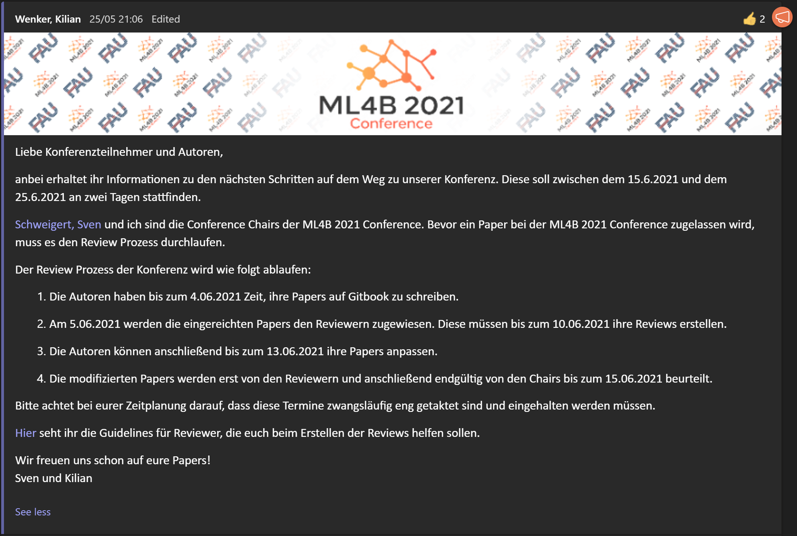
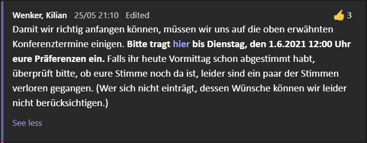

# Teams Nachrichten #
## Willkommen ##
Liebe Konferenzteilnehmer und Autoren,

anbei erhaltet ihr Informationen zu den nächsten Schritten auf dem Weg zu unserer Konferenz. Diese soll zwischen dem 15.6.2021 und dem 25.6.2021 an zwei Tagen stattfinden. 

Schweigert, Sven und ich sind die Conference Chairs der ML4B 2021 Conference. Bevor ein Paper bei der ML4B 2021 Conference zugelassen wird, muss es den Review Prozess durchlaufen.

Der Review Prozess der Konferenz wird wie folgt ablaufen:

1. Die Autoren haben bis zum 4.06.2021 Zeit, ihre Papers auf Gitbook zu schreiben.
2. Am 5.06.2021 werden die eingereichten Papers den Reviewern zugewiesen. Diese müssen bis zum 10.06.2021 ihre Reviews erstellen.
3. Die Autoren können anschließend bis zum 13.06.2021 ihre Papers anpassen. 
4. Die modifizierten Papers werden erst von den Reviewern und anschließend endgültig von den Chairs bis zum 15.06.2021 beurteilt. 

Bitte achtet bei eurer Zeitplanung darauf, dass diese Termine zwangsläufig eng getaktet sind und eingehalten werden müssen. 

Hier seht ihr die Guidelines für Reviewer, die euch beim Erstellen der Reviews helfen sollen.

Wir freuen uns schon auf eure Papers!
Sven und Kilian

## Umfrage zur Terminfindung ##
Damit wir richtig anfangen können, müssen wir uns auf die oben erwähnten Konferenztermine einigen. Bitte tragt hier bis Dienstag, den 1.6.2021 12:00 Uhr eure Präferenzen ein. Falls ihr heute Vormittag schon abgestimmt habt, überprüft bitte, ob eure Stimme noch da ist, leider sind ein paar der Stimmen verloren gegangen. (Wer sich nicht einträgt, dessen Wünsche können wir leider nicht berücksichtigen.)

## Konferenztermine verkünden ##
Konferenztermine - the votes are in!
    
Die ML4B 2021 Conference wird an den folgenden beiden Tagen stattfinden:
    
Sonntag, 20. June 2021 12:00 Uhr
    
Freitag, 25. June 2021 12:00 Uhr
    

Submission & Peer Reviewing - ML4B (gitbook.com)

