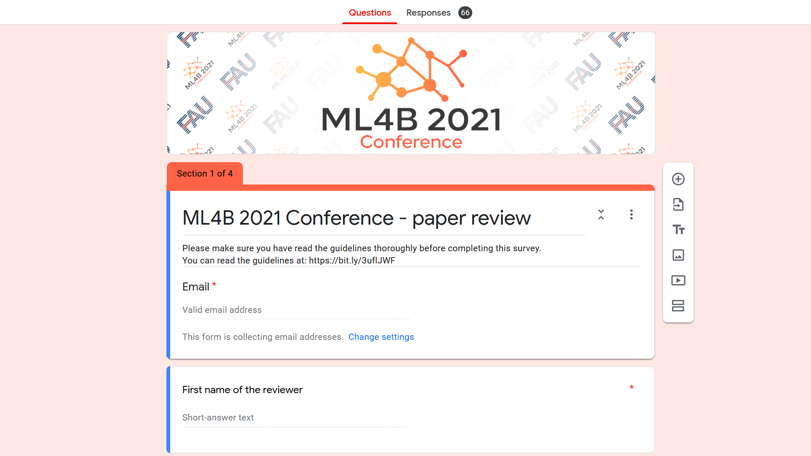
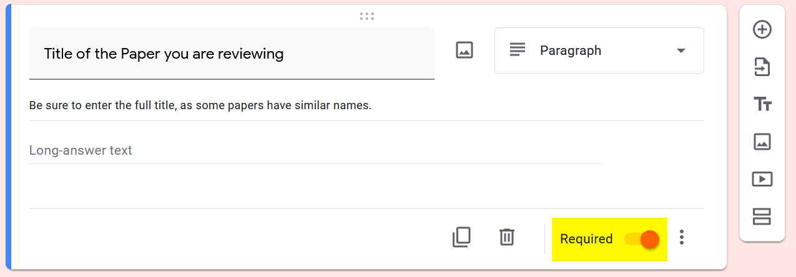
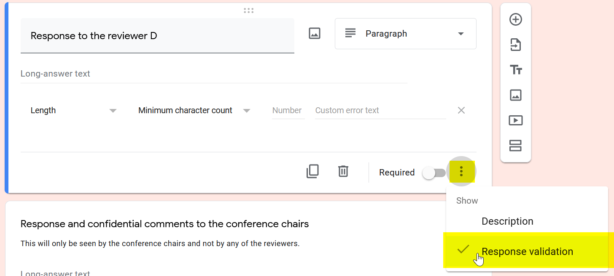
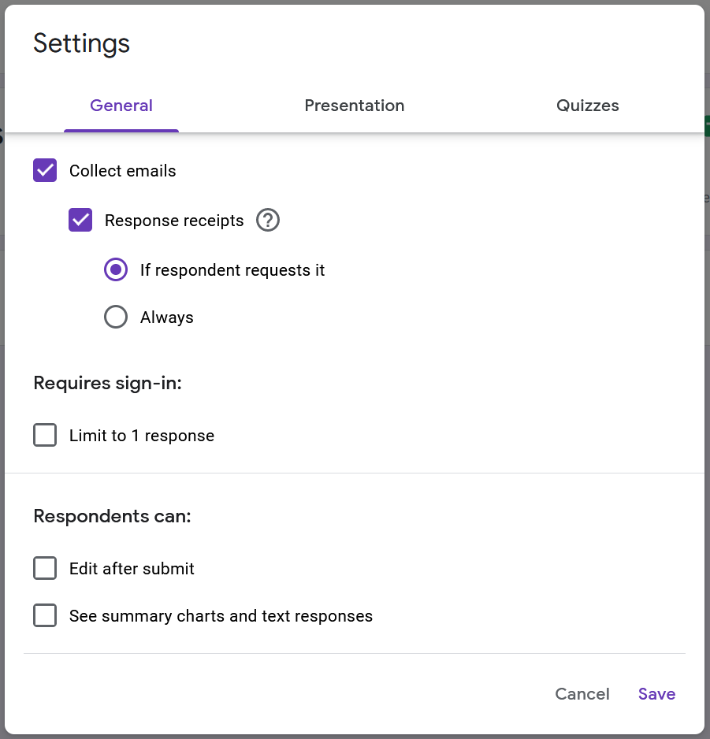
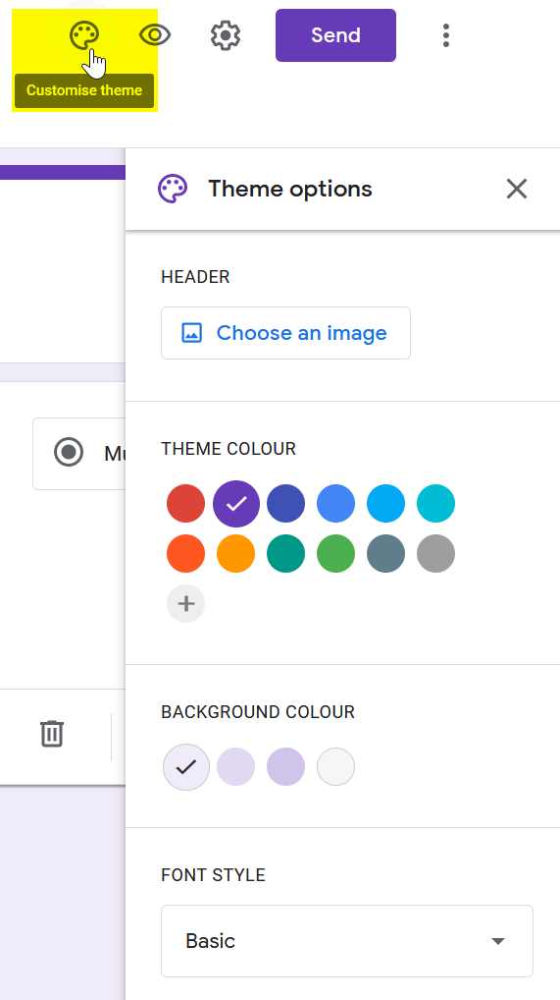
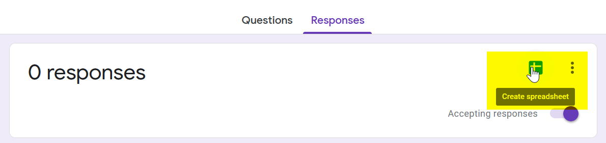

# Hinweise zum Erstellen von Umfragen mit Google Forms #

Feld zu einem Pflichtfeld machen:

Mindestlänge für Textfeld einstellen:

Einstellungen:

Design:

Die ML4B-Farbe ist `#FF6347`.

Spreadsheet automatisch erzeugen:

