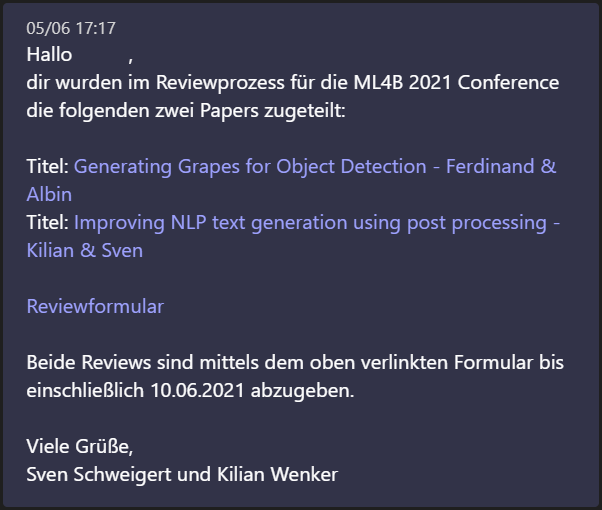
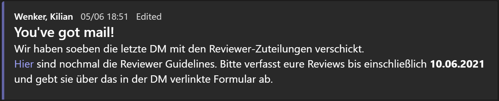

# Teams Nachrichten #
## Zuteilung (DM) ##
Hallo Vorname,
dir wurden im Reviewprozess für die ML4B 2021 Conference die folgenden zwei Papers zugeteilt:

 

Titel: Generating Grapes for Object Detection - Ferdinand & Albin 
Titel: Improving NLP text generation using post processing - Kilian & Sven  
 
Reviewformular

Beide Reviews sind mittels dem oben verlinkten Formular bis einschließlich 10.06.2021 abzugeben.

 

Viele Grüße,
Sven Schweigert und Kilian Wenker

## Zuteilung (Allgemein) ##
You've got mail!
    
Wir haben soeben die letzte DM mit den Reviewer-Zuteilungen verschickt.
Hier sind nochmal die Reviewer Guidelines. Bitte verfasst eure Reviews bis einschließlich 10.06.2021 und gebt sie über das in der DM verlinkte Formular ab.

