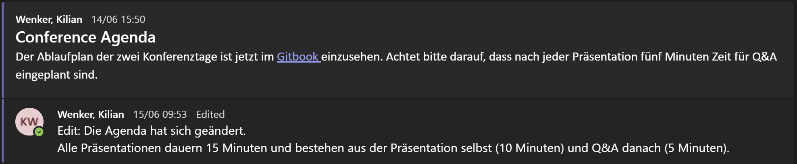

Der Ablaufplan der zwei Konferenztage ist jetzt im Gitbook einzusehen. Alle Präsentationen dauern 15 Minuten und bestehen aus der Präsentation selbst (10 Minuten) und Q&A danach (5 Minuten).  `(kombiniert)`

