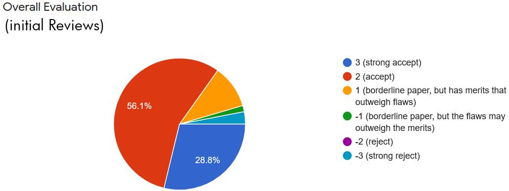

# how2conference #

[Projekt](#Projekt) |
[Checklisten](#Checklisten)

## Projekt ##

Ich habe im Sommersemester 2021 begleitend zum Modul Machine Learining for Business (ML4B) die _Machine Learning for Business Conference 2021_ und die vorgelagerten Peer Reviews organisiert. Das Projekt wurde im Format des Forschenden Lernens durchgeführt. Dieses Reposistory dient der Dokumentation meiner Arbeit und kann als Vorlage für zukünftige ML4B Konferenzen verwendet werden.
Die ML4B Conference 2021 war eine interne Konferenz auf der Studierende, die das Modul ML4B belegt haben, die Ergebnisse ihrer Forschungsprojekte vorgestellt haben. Dazu haben sie ein Forschungsprojekt im Bereich des Machine Learning durchgeführt, über die Ergebnisse ein Paper im wissenschaftlichen Stil verfasst und eingereicht, Papers anderer Studierenden Peer-Reviewt und nach einer Überarbeitung schließlich ihr Paper in Form einer Präsentation auf der Konferenz vorgestellt.

Hinweis: Die Vergabe der Themen bzw. Forschungsaufgaben an die Studierenden fand bereits vor dem Start des Projekts statt.

Das Projekt begann zum Anfang des Sommersemesters 2021, wurde in einem Teams-Meeting am 18. Mai 2021 per Projektplan konkretisiert und endete mit dem zweiten Konferenztag am 25. Juni 2021.

### 1. Zeitplan ###

Als erstes wurde die Rahmenanforderungen mit den Dozenten besprochen und die Kommunikationskanäle erstellt. Eine Woche später war bereits ein Zeitplan veröffentlicht. Nur die Konferenztermine fehlten im Zeitplan, da diese in einem Abstimmungsverfahren nach Präferenzen der Teilnehmer festgelegt werden sollten. Diese Terminabstimmung organisierte ich über das Tool [Terminklick](https://terminklick.stuve.fau.de/) der Studierendenvertretung der FAU. Anschließend wurden die zwei beliebtesten Termine als Konferenztermine ausgewählt und verkündet.

Es musste frühzeitig eine Seite im Gitbook geschrieben werden, auf der alle Information zu finden waren, die für die Konferenz relevant waren. Jede wichtige Information wurde über Teams mitgeteilt. Friendly Reminder im Konferenzkanal auf MS-Teams sorgten immer wieder dafür, dass Deadlines nicht allzu leicht oder versehentlich missachtet wurden. Es war hier sehr nützlich, heimliche grace periods einzuplanen, weil die Deadlines nicht immer eingehalten werden. 

Als Kopf der Gitbookseite habe ich eine Welcome Message erstellt, diese besteht aus einem Einleitungstext für die Konferenzteilnehmer und zwei Fotos der Konferenzleiter.

### 2. Abgabe der Papers ###

Als nächstes wurden Conference Guidelines für die Reviewer erstellt. Hierzu orientierte ich mich an typischen Vorgaben echter wissenschaftlicher Konferenzen (insbesondere Machine Learning Konferenzen) und versuchte, die Forderungen etwas zu reduzieren, damit es machbar blieb. 

Damit die Reviewers Reviews erstellen können, ohne dass die Autoren ihre Version weiterentwickelt haben (manche Autoren schaffen es nicht, bis zur Deadline ihr Paper fertig zu stellen und dürfen es auch bis zur Konferenz ständig weiterentwickeln), habe ich im Gitbook einen neuen Ordner für Reviewers‘ copies, erstellt und mich mit gitbook vertraut gemacht. In der aktuellen Version von Gitbook ist das duplizieren von Seiten nicht trivial, weswegen ich froh war, dass ich das Kopieren bereits getestet hatte. 

### 3. Abgabe der Reviews ###

Gleich nach der Deadline für die Abgabe der Papers habe ich die Reviewers‘ copies erstellt. Diese Kopien haben so den Stand zum Abgabetermin „eingefroren“ und durften nun nicht mehr verändert werden, die Live-Version der Papers hingegen schon. 

Anschließend habe ich mit [Google Forms](https://www.google.de/intl/de/forms/about/), das sich wegen der Integration mit Google Sheets für die Konferenzzwecke gut eignet, ein Survey erstellt für die Reviews, das die Vorgaben der Reviewers‘ Guidelines wie die Kriterienkataloge, die Textbeschreibungen und die Notenskalen umsetzt.

Mit Java habe ich ein Skript (assignment.java) erstellt, das zufallsgesteuert unter Berücksichtigung einiger Regeln die Papers jeweils vier Reviewer pro Paper zuteil. Die Ausgabe kann als csv-Datei gespeichert werden. Außerdem generiert das Skript die Direktnachrichten für alle Teilnehmer. 
Die csv-Datei habe ich anschließend zur "vollen" Excel-Datei konvertiert (better_assignment.xlsx) und erweitert. Sie enthält zusätzlich zur Zuteilung Reviewers - Papers: Spalten für die Überwachung des Direktnachrichten-Versands, eine invertierte Tabelle mit den Papers. Letztere ist nützlich um nachzusehen, wer der Reviewer mit dem Alias A, B, C oder D ist und wer die zugeordneten Chair Reviewer sind. All das ist aus der ursprünglichen Tabelle nicht oder zumindest nicht direkt ersichtlich, wird aber im Verlauf des Projekts gebraucht, beispielsweise um die Antworten auf die Reviews den richtigen Reviewern (s. weiter unten) zuzusenden. Wichtig an dieser Stelle ist auch, dass das Chair Review für die Conference Chairs nicht von diesen, sondern von einem anderen Studierenden geschrieben werden sollten (sonst würden sich die Chairs ihr Chair Review selbst schreiben). Mein Skript vermeidet dies.

Danach habe ich allen Teilnehmern Direktnachrichten geschrieben, mit dem Inhalt, welche zwei Papers zu erstellen sind und einem Link zu den Reviewer’s copies und zum Survey. 

Trotzdem kommen dann menschliche Fehler wie z.B., dass Studierende aus Versehen die Anpassungen als Antwort auf ihre Reviews nicht in der Live-Version einbauen, sondern in den Reviewers‘ copies (ich habe dann z.B. an den Anfang aller Reviewers‘ copies eine Infobox gestellt mit dem Hinweis „This is the Reviewers' Copy. Do not edit this page.“). 

Ein Problem war, dass eine Studierende wegen des Arbeitsvolumens aufgehört hat und deshalb ihre Reviews auch nicht mehr schrieb – ihr Partner machte jedoch weiter. Dadurch fehlten zwei Reviews, die auch leider von niemandem aus der Studentenschaft übernommen wurden. Ein weiteres Problem war, dass zwei Reviews so mangelhaft formuliert waren, dass sie von mir als Chair nach Rücksprache mit den Dozenten herausgenommen wurden.

### 4. Paper Anpassungen ###

Die Reviews habe ich dann als Subseiten an die Reviewers‘ copies angehängt, nachdem ich sie in ein Markdown Template eingesetzt habe. Dadurch, dass alle Seiten von mir erstellt wurden, blieb die Anonymität der Reviewer gewahrt. An jede Review wurde auch ein Hinweis auf die nächste Deadline gehängt.

Danach habe ich angefangen, die Chair Reviews zu schreiben und ebenfalls als Unterseite in Gitbook angehängt. Zu Transparenzzwecken habe ich an mein eigenes Chair Review die Infobox gehängt: „To avoid a conflict of interest, this review was not written by the conference chairs who are also the authors of this paper.“

Ein Survey, 'Authors Response to Reviewers' wurde erstellt und per Direktnachrichten an alle Teilnehmer geschickt,  zusammen mit der Infromation, dass die Reviews und Chair Reviews fertig sind. Ich konnte diese Nachricht immer direkt in den chat einfügen, weil ich diesmal personalisierungen wie eine namentliche Anrede weggelassen habe. Das hat den Zeitaufwand ein wenig reduziert.

Nachdem diese Deadline abgelaufen war viel auf, dass sie von zwei Teams nicht eingehalten wurde. Hier schaffte eine Ermahnung in einer dazu erstellten Teams-Gruppen-DM mit den Dozierenden und den betroffenen Studierenden Abhilfe und die Responses wurden nachgereicht. 

### 5. Finale Empfehlungen ###

Das letzte Survey, „Reviewers‘ final Recommendation“, diente dazu, dass die Reviewer ihre Gesamtnoten für das Paper ändern konnten, nachdem sie die Antworten und Änderungen oder Weiterentwicklungen gelesen hatten. Diese wurden ihnen einzeln Per DD zugesendet. Durch die Anonymität konnten die Autoren nicht wissen, welche Studierenden das Review formuliert hatten. Somit musste die Zuteilungstabelle verwendet werden, um den Reviewer zu identifizieren um ihm die Response zukommen lassen zu können. Mit copy & paste wurde jedem Reviewer per DM ein entsprechender Text mit den Responses geschickt.

Nach der Deadline für die Final Recommendation habe ich verkündet, dass alle Papers angenommen wurden (wäre ein Paper nicht empfohlen worden, hätte es trotzdem bei der Konferenz vorgestellt werden müssen). Die freundlichen Bewertungen durch die Mitstudierenden, die inhaltlich hilfreich aber in der Skalierung sehr positiv waren, liesen mich alle Papers bedenkenlos annehmen.

Ein paar Studierende fragten per DM aktiv nach, ob ihre Bewertung nach den Anpassungen verändert wurden. Die finalen Bewertungen sind für die Conference Chairs gedacht, um den Chairs die Entscheidung  zu erleichtern. Daher hatte ich diese den Autoren nicht von vorn herrein zugeschickt. Trotzdem habe ich die Anfragen gerne ehrlich beantwortet.

### 6. Konferenz ###

Nun musste die Agenda der Konferenz erstellt werden. Theoretisch wäre es über die Präferenzen aus der Terminklick-Abstimmung gegangen, allerdings habe ich mich letztlich dagegen entschieden. In Anlehnung an echte Konferenzen, die mehrere thematisch aufgeteilte Tracks haben, habe ich für die jeden der zwei Konferenztage ein Thema als roten Faden festgelegt. Den beliebtesten Tag haben ich als den gewählt, an dem die meisten Präsentationen sein sollten. Es entstanden der Image Day und der Text Day. Wie die Namen vermuten lassen waren am ersten Konferenztag waren Präsentationen zu Machinelearning mit Bildern geplant und am zweiten Präsentationen zu Projekten mit Machinelearing mithilfe von Text. Die Agenda im Gitbook wurde entsprechend sortiert und eingefügt. 

Ich habe in Teams einen Ordner angelegt, in dem alle Teilnehmer ihre Dateien für die Präsentation hochladen konnten, damit sie am Konferenztag zur Verfügung standen (und auch den Dozenten hinterher für die Bewertung dienten).

Um die Konferenz zu beginnen hatte ich eine kurze Rede geschrieben, und anschließend frei in zusammenarbeit mit den Dozenten dei Konferenz moderiert. Besonders wichtig war dabei die Uhrzeit im Auge zu behalten und gegebenenfalls Dinge wie Demonstrationen nach hinten zu verschieben um den Zeitplan einzuhalten. 

Beide Konferenztage hatten ein Open End, das erfreulicherweise beide male noch über eine Stunde angehalten hat. Auch insgesamt hat die Konferenz den Teilnehmern laut deren R​ückmeldungen sehr gut gefallen.

### Allgemeines ###

#### Kommunikationskanäle ####
Als Chair hatte ich vier Kanäle zur Verfügung, um Informationen zur Konferenz zu teilen:  
1. die eigene Gitbook-Page mit allen Informationen zur Konferenz auf einer Seite,  
2. der eigene Teams-Kanal (für aktuelle Informationen und Friendly Reminders an Deadlines)  
3. das Vorlesungsmeeting in Form der Videokonferenz (hier konnte ich nach Absprache mit den Dozenten live Updates zur Konferenz geben)  
4. Direktnachrichten per Teams (für sehr wichtige oder individuelle Informationen). 

Es ist wichtig alle Informationen frühzeitig und über meherere Kanäle zu komunizieren. Insbesondere Ansagen wie Deadlines habe ich immer über drei oder alle vier kanäle kommuniziert. Zusätzlich habe ich am Tag deren Ablaufs noch einmal auf die Deadlines hingewiesen. Das hat die Konferenzorganisation erleichtert, und für einen nahezu reibungslosen Ablauf gesorgt.

#### Branding ####
Von den Dozenten erhielt ich ein Logo, aus dem ich einen Banner entwickelte. Letzteren habe ich in alle wichtigen Posts und in Gitbook an den Anfang gestellt, um ein professionelleres Bild zu erzeugen. Außerdem habe ich den Teilnehmern einen Teams-Background-Filter zur verfügung gestellt, der an den Konferenztagen von fast allen Teilnehmern genutzt wurde. Das ergab ein schönes Bild beim Finale, wirkte etwas genormter und authentischer und zeigte, wie gut das Branding durch die permanente Wiederholung funktioniert hat – es sah gewissermaßen so aus, als ob es eine nicht-virtuelle Konferenz gewesen wäre bei der die Teilnehmer nebeneinader vor einer Fotoleinwand sitzen.

#### Für die Zukunft ####
Die Konferenz kann, sollte sie ein weiteres mal online stattfinden, per [Gathertown](https://gather.town/) abgehalten werden, falls dies kostenlos möglich wird oder die FAU die Mittel hierfür bereitstellen kann (dann könnte das Ganze mit mehr Echtheitsflair und etwas interaktiver gestaltet werden, u.a. durch Proximity Chat, Poster aufstellen, man trifft sich zufällig im virtuellen Gang etc.). Damit wurden schon echte ML-Konferenzen gehalten.

## Checklisten ##
Die Nachfolgenden sechs Checklisten zeigen die Aufgaben die zur Durchführung des jeweilgen Abschnitts erledigt werden mussten. Diese sind in chronologischer Reihenfolge aufgebaut. Manche Unterpunkte können auch in einer anderen Reihenfolgen abgearbeitet werden, die hier angegebene Reihenfolge ist allerdings in dieses Fällen genauso gut oder besser als die Alternativen.

### 1. Zeitplan ###
[(Nachrichten)](<1. Zeitplan/messages.md>)
- [ ] Kommunikationskanäle erstellen (z.B. Teams Channel und Gitbook Seite)
- [ ] Zeitplan bis zur Konferenz passend zum Veranstaltungsrahmen erstellen
- [ ] Willkommensnachricht(en) erstellen [(Gitbook Beispiel)](<gitbook page.md>)
- [ ] Umfrage zur Terminfindung der Konferenztermine durchführen [(Ergebnisse Export)](<1. Zeitplan/conference_dates_poll.csv>)
- [ ] Anhand des Umfrageergebnises den Zeitplan mit den Konferenzterminen vervollständigen

### 2. Abgabe der Papers ###
- [ ] Reviewers Guidelines erstellen [(Beispiel)](<2. Abgabe der Papers/ML4B_Conference_Paper_Reviewer_Guidelines.pdf>)
- [ ] Gitbook Ordner für Reviewers Copies erstellen
- [ ] Vor der Deadline das duplizieren der Gitbookseiten testen

### 3. Abgabe der Reviews ###
[(Nachrichten)](<3. Abgabe der Reviews/messages.md>)
- [ ] Nach der Deadline Kopien aller Papers erzeugen und in Reviewers Copies speichern [(Disclaimer-Nachricht)](<3. Abgabe der Reviews/Gitbook RC disclaimer.md>)
- [ ] 'Review Survey' passend zu den Guidelines erstellen [(Beispiel)](<3. Abgabe der Reviews/Survey - review.pdf>) [(Forms-Tipps)](<3. Abgabe der Reviews/Google_forms_hints.md>)
- [ ] Reviewern Papers zuteilen & per DM benachrichtigen

### 4. Paper Anpassungen ###
[(Nachrichten)](<4. Paper Anpassungen/messages.md>)
- [ ] Alle Reviews als Unterseiten der jeweiligen Reviewers Copies veröffentlichen  
- [ ] Chair Review für jedes Paper erstellen
- [ ] 'Authors Response to Reviewers' Survey erstellen

### 5. Finale Empfehlungen ###
[(Nachrichten)](<5. Finale Empfehlungen/messages.md>)
- [ ] 'Final Recomendation' Survey erstellen
- [ ] Responses per DM an die jeweiligen Reviewer senden

### 6. Konferenz ###
[(Nachrichten)](<6. Konferenz/messages.md>)
- [ ] Anhand des Reviewprozess entscheiden ob alle Papers zur Konferenz "zugelassen werden" (Es geht hierbei vor allem um die vollständige Simulation des Reviewprozess für die Teilnehmer, unabhängig von diesem Urteil werden alle Papers bei der Konferenz vorgestellt)
- [ ] Ablaufplan für die Konferenztage erstellen
- [ ] Teams Ordner für Präsentationsdateien erstellen 
- [ ] Eröffnungsansprache erstellen
- [ ] Konferenz zusammen mit Martin und Markus moderieren